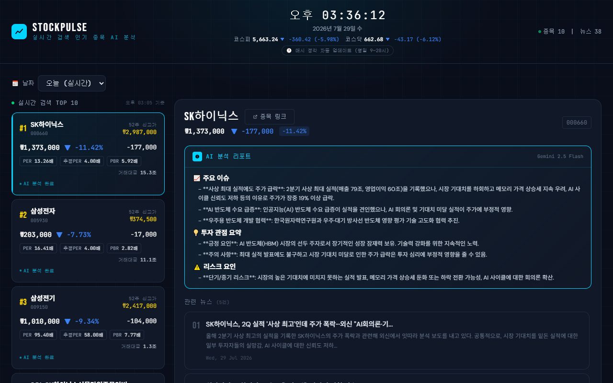
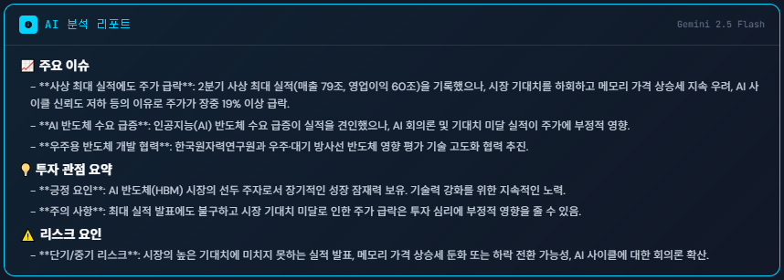
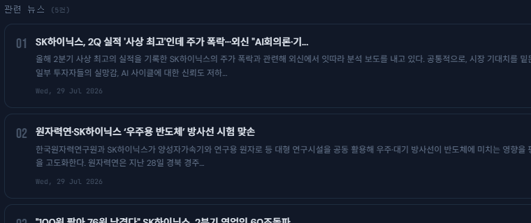
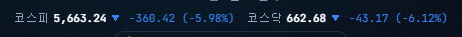
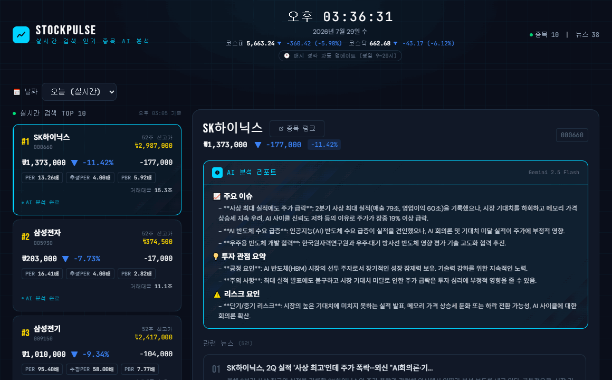
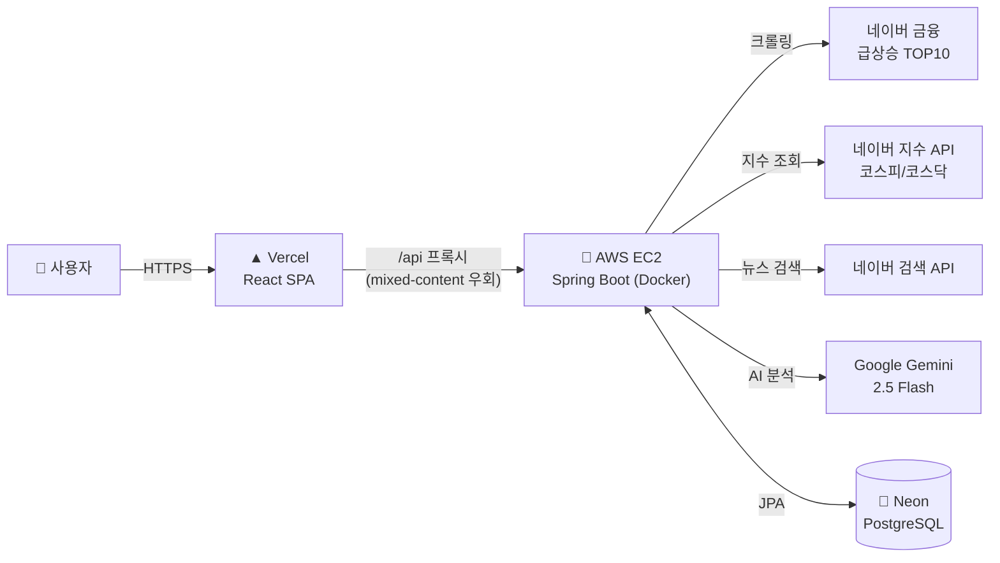
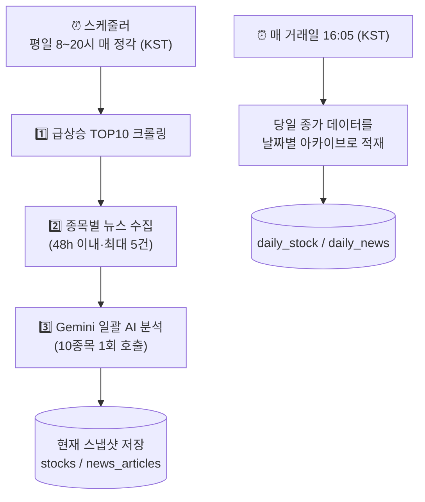
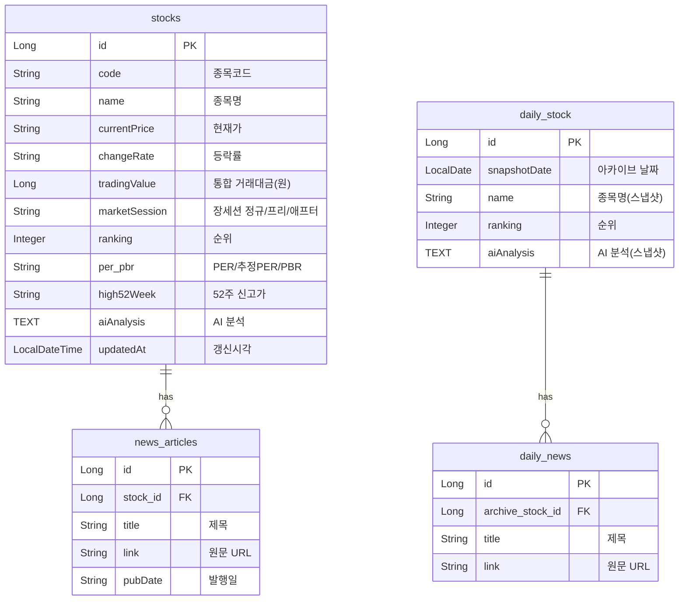

<div align="center">

# 📈 StockPulse

### 실시간 급상승 종목 뉴스 AI 분석 서비스

네이버 금융의 **실시간 검색 급상승 TOP 10** 종목을 자동으로 수집하고,
관련 뉴스와 **Google Gemini AI 투자 분석**을 한 화면에서 보여주는 웹 서비스입니다.

<br/>

[](https://ai-stock-news-smoky.vercel.app)

<br/>


</div>

---

## 📖 소개

주식 초보자가 "지금 갑자기 오르내리는 종목이 **왜** 그런지" 알기 위해선
여러 사이트를 돌아다니며 시세·뉴스·재무지표를 직접 조합해야 합니다.

**StockPulse는 이 과정을 자동화합니다.**

> 급상승 종목 크롤링 → 관련 뉴스 수집 → AI가 이슈·투자관점·리스크를 요약
> → 한 화면에서 확인 → 날짜별로 기록까지 보관

평일 **8~20시(넥스트레이드 프리장~애프터마켓) 매 정각** 자동 갱신되며, 매 거래일 **종가(16시)** 데이터는 별도로 아카이브되어 과거 날짜를 골라 다시 볼 수 있습니다.

<div align="center">

### 🔗 **https://ai-stock-news-smoky.vercel.app**

</div>

<div align="center">
  
  <br/>
  <sub>한 화면에서 급상승 TOP10 · AI 투자 분석 · 관련 뉴스 · 코스피/코스닥 지수를 확인</sub>
</div>

---

## ✨ 주요 기능

한눈에 보기 👇

| # | 기능 | 요약 |
|---|------|------|
| 1 | 🔥 실시간 급상승 TOP 10 | 인기검색 종목을 매 정각 크롤링 (거래대금·PER·52주고 등) |
| 2 | 🤖 Gemini AI 투자 분석 | 이슈 / 투자관점 / 리스크 3섹션 자동 요약 |
| 3 | 📰 관련 뉴스 자동 수집 | 48h 이내·최대 5건 선별 |
| 4 | 📊 코스피·코스닥 지수 | 상단 실시간 지수 |
| 5 | 🗓 날짜별 아카이브 | 과거 거래일 종가 데이터 다시보기 |

> 📷 아래 이미지·GIF는 **실제 라이브 사이트에서 캡처**한 것입니다. (교체/재생성 방법은 [맨 아래](#-스크린샷--gif-재생성) 참고)

<br/>

### 🔥 1. 실시간 급상승 TOP 10

<div align="center"></div>

화면 왼쪽에 **네이버 금융 인기검색 급상승 종목 1~10위**가 카드로 나열됩니다. 각 카드는 종목 하나에 대한 요약 대시보드예요.

**카드에 담기는 정보** (예: `#1 SK하이닉스`)
- **현재가 / 등락률 / 전일대비** — `₩1,373,000 · ▼ -11.42% · -177,000`
- **거래대금** — `15.3조` 처럼 **조·억 단위로 환산**해 표시 (원 단위 거래량보다 규모가 직관적)
- **PER / 추정PER / PBR** — `13.26배 / 4.00배 / 5.92배` (값이 없으면 `X`)
- **52주 신고가** — `₩2,987,000` (현재가와 비교해 고점 대비 위치를 가늠)
- **AI 분석 완료** 뱃지 — 이 종목의 AI 리포트가 준비됐다는 표시
- **장 세션 뱃지** — 정규장 외 시간엔 **넥스트레이드(NXT) 실시간 가격**을 반영하고 `🌅 프리장` / `🌙 애프터마켓` 뱃지 표시

> 💡 등락 색상은 **한국식** 입니다 — 상승 🔴 **빨강**, 하락 🔵 **파랑** (해외식과 반대).
> 🕗 가격은 넥스트레이드 **프리장(08시)~정규장~애프터마켓(20시)** 을 실시간 시세로 커버합니다.

<br/>

### 🤖 2. Gemini AI 투자 분석

<div align="center"></div>

카드를 클릭하면 오른쪽 패널에 **Google Gemini 2.5 Flash** 가 생성한 투자 분석 리포트가 나타납니다. 종목의 시세 지표 + 수집된 뉴스를 함께 넣어 분석하며, 항상 **3개 섹션**으로 정리됩니다.

- **📈 주요 이슈** — 오늘 이 종목이 왜 움직였는지 (뉴스 기반 핵심 이벤트)
- **💡 투자 관점 요약** — 긍정 요인 / 주의 요인
- **⚠️ 리스크 요인** — 단기·중기 리스크

> ⚙️ 10개 종목을 **한 번의 API 호출**로 일괄 분석해 비용/속도를 최적화했습니다.
> ⚠️ AI 자동 생성 참고 자료이며 투자 권유가 아닙니다.

<br/>

### 📰 3. 관련 뉴스 자동 수집

<div align="center"></div>

AI 리포트 아래에는 **네이버 검색 API로 수집한 관련 뉴스**가 붙습니다.
- **48시간 이내** 발행 + **제목에 종목명 포함** 기사만 선별 (노이즈 제거)
- 종목당 **최대 5건**, 제목·요약·발행일 표시
- 클릭하면 **원문 기사**가 새 탭으로 열립니다

<br/>

### 📊 4. 코스피 · 코스닥 지수

<div align="center"></div>

상단 헤더 시계 아래에 **코스피·코스닥 실시간 지수**가 표시됩니다 (예: `코스피 5,665.44 ▼ -358.22 (-5.95%)`). 개별 종목이 시장 전체 흐름과 어떤지 배경을 함께 볼 수 있어요. (백엔드에서 30초 캐시)

<br/>

### 🗓 5. 날짜별 아카이브 (과거 데이터 다시보기)

<div align="center"></div>

현재 데이터는 매시간 덮어써지지만, 매 거래일 **종가(16:05 KST)** 시점의 TOP10·뉴스·AI 분석은 **날짜별로 아카이브**됩니다.

- 상단 **날짜 선택기**에서 `오늘 (실시간)` ↔ 과거 날짜 전환
- 과거 날짜를 고르면 **"📁 YYYY-MM-DD 종가 기준 아카이브"** 로 바뀌며, 그날의 종목·뉴스·AI 리포트를 그대로 다시 볼 수 있음
- "어제 1위는 뭐였고 왜 올랐지?" 같은 **회고**가 가능

> 🏛 구조: 현재 스냅샷(hot) + 날짜별 누적 아카이브(cold) 하이브리드 → [ERD](#-데이터베이스-erd) 참고

<br/>

### ⏱ 자동 갱신

- 평일 **8~20시(프리장 08시~애프터마켓 20시) 매 정각** 자동 크롤링·분석 (KST), 공휴일 자동 휴장
- 서버 타임존을 `Asia/Seoul` 로 고정해 표시 시각이 한국시간과 일치


## 🛠 기술 스택

<div align="center">

| 구분 | 기술 |
|------|------|
| **Frontend** | React 18 (CRA), Tailwind CSS v3, Axios |
| **Backend** | Java 17, Spring Boot 3.2, Spring Data JPA, Spring Scheduler |
| **크롤링 / 외부 연동** | Jsoup(HTML 크롤링), Spring WebFlux WebClient |
| **Database** | H2 (로컬) / PostgreSQL — [Neon](https://neon.tech) (운영) |
| **AI / 외부 API** | Google Gemini 2.5 Flash, 네이버 검색 API, 네이버 금융/지수 |
| **Infra / 배포** | Docker, AWS EC2, Vercel |

</div>

---

## 🏗 시스템 아키텍처



- **프론트(Vercel)** 는 HTTPS, **백엔드(EC2)** 는 HTTP라 브라우저가 직접 호출하면 mixed-content로 차단됩니다.
  → Vercel `rewrites` 로 `/api/*` 요청을 EC2로 **서버사이드 프록시**하여 해결 (백엔드 HTTPS/도메인 불필요).

---

## 🔄 동작 방식



- 현재 데이터(`stocks`, `news_articles`)는 매 갱신마다 **덮어쓰기** → 항상 최신 스냅샷만 유지
- 아카이브(`daily_stock`, `daily_news`)는 **append-only** 누적 → 과거 이력 보존 (hot + cold 구조)

---

## 🗂 REST API

| Method | Endpoint | 설명 |
|--------|----------|------|
| `GET` | `/api/stocks/top10` | 급상승 TOP 10 종목 |
| `GET` | `/api/stocks/{id}/news` | 종목별 뉴스 + AI 분석 |
| `POST` | `/api/stocks/refresh` | 수동 갱신 트리거 |
| `GET` | `/api/market/indices` | 코스피·코스닥 실시간 지수 |
| `GET` | `/api/archive/dates` | 아카이브가 있는 날짜 목록 |
| `GET` | `/api/archive/{date}/stocks` | 특정 날짜의 TOP10 |
| `GET` | `/api/archive/stocks/{id}/news` | 아카이브 종목의 뉴스 + AI |
| `POST` | `/api/archive/run` | 오늘 데이터 수동 아카이브 |
| `GET` | `/api/health` | 서버 상태 (종목/뉴스 개수) |

---

## 🗄 데이터베이스 (ERD)



---

## 📁 프로젝트 구조

```
.
├── backend/                Spring Boot 3.2 (Java 17, Gradle)
│   └── src/main/java/com/stocknews/
│       ├── controller/     REST API
│       ├── service/        크롤링 · 뉴스 · Gemini 분석 · 지수 · 아카이브
│       ├── scheduler/      정각 갱신 + 16:05 아카이브
│       ├── entity/         Stock, NewsArticle, DailyArchiveStock/News
│       └── repository/     Spring Data JPA
├── frontend/               React 18 (CRA) + Tailwind CSS
│   └── src/
│       ├── api/            axios 클라이언트
│       └── components/     Header, StockCard, NewsPanel
├── docker-compose.yml      백엔드 컨테이너 (외부 Neon DB 연결)
└── docs/DEPLOY.md          배포 가이드 (EC2 / Vercel / Neon)
```

---

## 🚀 로컬 실행

### 1. 백엔드 (H2 인메모리)

```bash
cd backend
# src/main/resources/application-local.yml 에 API 키 입력 (git 미추적)
./gradlew bootRun
```
- 서버: `http://localhost:8080`
- H2 콘솔: `http://localhost:8080/h2-console` (JDBC: `jdbc:h2:mem:stockdb` / `sa` / 빈칸)

### 2. 프론트엔드

```bash
cd frontend
npm install
npm start   # http://localhost:3000
```

> `application-local.yml` 예시
> ```yaml
> naver:
>   api:
>     client-id: YOUR_NAVER_CLIENT_ID
>     client-secret: YOUR_NAVER_CLIENT_SECRET
>     news-url: https://openapi.naver.com/v1/search/news.json
> gemini:
>   api:
>     key: YOUR_GEMINI_API_KEY
>     url: https://generativelanguage.googleapis.com/v1beta/models/gemini-2.5-flash:generateContent
> ```

---

## ☁️ 배포

| 구성 | 서비스 |
|------|--------|
| **Frontend** | Vercel (Root: `frontend`, env `REACT_APP_API_URL=/api`) |
| **Backend** | AWS EC2 — `docker compose up -d --build` |
| **Database** | Neon (무료 PostgreSQL) |

자세한 절차는 **[docs/DEPLOY.md](docs/DEPLOY.md)** 참고.

---

## 🔑 환경변수

| 변수 | 용도 | 위치 |
|------|------|------|
| `NAVER_CLIENT_ID` / `NAVER_CLIENT_SECRET` | 네이버 검색 API | EC2 `.env` / 로컬 `application-local.yml` |
| `GEMINI_API_KEY` | Gemini 2.5 Flash | 동일 |
| `DATABASE_URL` / `DATABASE_USERNAME` / `DATABASE_PASSWORD` | PostgreSQL(운영) | EC2 `.env` |
| `CORS_ALLOWED_ORIGINS` | 허용 오리진 | 선택 (기본: localhost + `*.vercel.app`) |
| `REACT_APP_API_URL` | 프론트가 호출할 API 경로 | Vercel 환경변수 |

---

## 👤 Author

**zizonpubao** · [GitHub](https://github.com/zizonpubao)

---

<div align="center">

> ⚠️ 본 서비스는 AI 자동 생성 정보를 제공하며, **투자 권유가 아닙니다.**
> 투자 손실에 대한 책임은 본인에게 있습니다.

</div>
